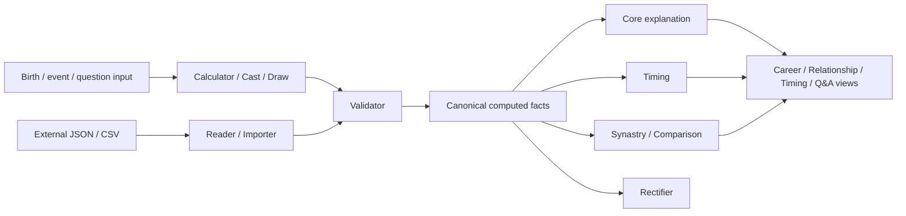

<div align="center">

# Divination Skills

**A multi-system, verifiable, and traceable computation and AI Skill framework**

[中文](README.md) · [Implementation status](docs/IMPLEMENTATION_STATUS.md) · [Extension roadmap](docs/EXTENSION_PLAN.md) · [Completion audit](docs/COMPLETION_AUDIT.md)

[](https://github.com/dajiaohuang/divination-skills/actions/workflows/validate.yml)
[](pyproject.toml)
[](#system-coverage)
[](#the-30-skills)
[](#rules-sources-and-traceability)
[](LICENSE)

</div>

---

`divination-skills` does not place ten divination systems inside one giant prompt. Each system has
isolated calculation, import, validation, timing, comparison, interpretation, provenance, and
safety boundaries. System-neutral contracts compose those parts without silently blending
lineages.

The M0–M13 technical roadmap is implemented and automatically verified. Formal production release
remains closed until real domain, rights, and deployment-privacy reviews are complete.

```text
technical_complete = 10 / 10
release_ready = 0 / 10
```

## Contents

- [Design goals](#design-goals)
- [Architecture](#architecture)
- [System coverage](#system-coverage)
- [Installation](#installation)
- [Quick start](#quick-start)
- [The 30 Skills](#the-30-skills)
- [Rules, sources, and traceability](#rules-sources-and-traceability)
- [Testing and reproducible packages](#testing-and-reproducible-packages)
- [Repository layout](#repository-layout)
- [Reference repositories and independence](#reference-repositories-and-independence)
- [Release state and boundaries](#release-state-and-boundaries)
- [Contributing, security, and license](#contributing-security-and-license)

## Design goals

Many divination products mix chart calculation, school-specific rules, generated language, and
product copy. When a result is disputed, it becomes impossible to tell whether the cause was a time
input, calendar boundary, calculation, lineage choice, or improvised interpretation.

This project separates every result into four layers:

1. **Raw and normalized input** — time, time zone, coordinates, entropy seed, question category,
   and explicit policy selections.
2. **Deterministic facts** — charts, cards, palaces, stars, lines, numbers, and time intervals.
3. **Rule-derived findings** — only registered rules may run, with fact, rule, and source IDs.
4. **Language explanation** — may not overwrite computed facts and must degrade or refuse when
   evidence is insufficient.

The resulting engineering constraints are:

- keep systems, schools, and historical periods isolated;
- physically separate computation from interpretation;
- never let an imported chart overwrite native facts;
- disable precision-sensitive modules when birth-time precision is insufficient;
- make randomized operations seed-replayable and auditable;
- downgrade medical, legal, financial, safety, and other high-impact questions.

## Architecture



I Ching, Liuyao, Qimen, Tarot, Lenormand, and runes retain their own question-time or symbolic-draw
workflows. They do not reuse Vedic Prashna, Western natal, or unrelated system rules.

Six shared contracts compose the systems:

| Contract | Purpose |
|---|---|
| `reading-session` | Session, question category, chart references, consent, and data class |
| `chart-import` | External provenance, field mapping, missing fields, and conflicts |
| `confidence-profile` | Input precision, module degradation, and disabled-module reasons |
| `timeline` | Shared intervals for luck cycles, annual layers, and transits |
| `comparison` | Directional A→B/B→A and symmetric two-chart facts |
| `report-profile` | Section selection for core, career, relationship, and timing views |

## System coverage

| System | Version | Implemented technical scope | Skills |
|---|---:|---|---:|
| Bazi | 0.2 | Four Pillars, solar terms, hidden stems, Ten Gods, branch relations, luck cycles, imports, timing, synastry facts, and double-hour scanning | 7 |
| Western astrology | 0.2 | Tropical natal charts, whole-sign/equal houses, major aspects, transits, solar returns, synastry, and time-interval scanning | 7 |
| Ziwei Dou Shu | 0.4 | Native palaces/stars, four twelve-stage cycles, transformations, six timing scopes, queries, imports, structural core, and comparison | 6 |
| Tarot | 0.2 | Project-authored text deck, seven spreads, reversals, combination summaries, and consent-gated local journal statistics | 3 |
| Liuyao | 0.2 | Eight palaces, Shi/Ying, Najia, Six Relations, Six Spirits, void branches, candidate useful-deity and explicit strength factors | 2 |
| I Ching | 0.2 | Replayable three-coin casts, 64 hexagrams, moving/changed lines, two explicit selection policies, and source locators | 1 |
| Qimen Dunjia | 0.2 | Chaibu rotating plate, earth/heaven plates, stars, doors, spirits, duty entities, and structural state markers | 1 |
| Lenormand | 0.2 | Project-authored 36-card text deck, pairs, nine-card grid, and 4×9 Grand Tableau houses/coordinates | 1 |
| Runes | 0.2 | Auditable Elder Futhark draws with strict historical-evidence/modern-reflection separation | 1 |
| Numerology | 0.2 | Isolated Pythagorean and Chaldean mappings with explicit user-supplied transliteration | 1 |

## Installation

### 1. Development environment

Requirements:

- Git;
- Python 3.11 or newer; CI runs Python 3.12;
- [`uv`](https://docs.astral.sh/uv/) is recommended.

```bash
git clone https://github.com/dajiaohuang/divination-skills.git
cd divination-skills
uv sync --extra dev
```

### 2. Build installable Skill packages

Do not copy `systems/*/skills/` directly: source Skill scripts reference repository modules. Build
self-contained packages first.

```bash
uv run divination-build . --system all --output dist
```

Each ZIP has a Skill-named root and includes:

- `SKILL.md` and `agents/openai.yaml`;
- the project runtime required by that Skill;
- a pinned `requirements.txt`;
- `CONTENT_MANIFEST.json` with per-file SHA-256;
- `THIRD_PARTY_NOTICES.json`;
- Apache-2.0 and project-license records.

### 3. Install into Codex

PowerShell:

```powershell
$target = Join-Path $HOME ".codex\skills"
New-Item -ItemType Directory -Force $target | Out-Null
Get-ChildItem dist\*.zip | ForEach-Object {
    Expand-Archive $_.FullName -DestinationPath $target -Force
}
```

Install one package:

```powershell
Expand-Archive dist\ziwei-calculator-0.4.0.zip `
  -DestinationPath "$HOME\.codex\skills" -Force
python -m pip install -r "$HOME\.codex\skills\ziwei-calculator\requirements.txt"
```

Linux/macOS:

```bash
mkdir -p "$HOME/.codex/skills"
for archive in dist/*.zip; do
  unzip -oq "$archive" -d "$HOME/.codex/skills"
done
```

Skills without third-party Python dependencies contain an empty `requirements.txt`.

## Quick start

Once installed, describe the task directly. Skill frontmatter provides semantic routing.

```text
Use bazi-calculator to calculate a Four Pillars chart for
1990-03-15 14:30 in Asia/Shanghai.

Create a natal chart with western-natal, then use western-timing to inspect
the structural transits on 2027-06-01. Do not predict a guaranteed event.

Calculate a Ziwei chart and use ziwei-validator to compare this external JSON.

Draw a Celtic Cross with tarot-draw, allow reversals, then pass the validated
draw to tarot-core for reflective interpretation only.

Cast with liuyao-core. Only after validation, use liuyao-judgment with an
explicit question category to list candidate useful-deity and strength facts.
```

Repository-local CLI examples:

```powershell
# Bazi
uv run python systems/bazi/skills/bazi-calculator/scripts/calculate.py `
  systems/bazi/examples/sample-input.json

# Ziwei
uv run python systems/ziwei/skills/ziwei-calculator/scripts/run.py `
  --local-datetime 2000-01-01T12:00:00 `
  --timezone Asia/Shanghai `
  --calculation-gender female

# I Ching
uv run python systems/iching/skills/iching-core/scripts/run.py `
  --question "Which structure in this decision deserves attention?"
```

Every entry point supports `--help`. Deterministic test workflows should provide a seed or complete
time-policy input explicitly.

## The 30 Skills

### Bazi

| Skill | Responsibility |
|---|---|
| `bazi-calculator` | Produce native Four Pillars facts from Gregorian local time and IANA zone |
| `bazi-reader` | Isolate untrusted JSON or explicit pillar-text imports |
| `bazi-validator` | Validate schema/boundaries/provenance and compare external charts by path |
| `bazi-core` | Explain only validated pillars, hidden stems, Ten Gods, and branch relations |
| `bazi-timing` | Generate explicitly directed luck-cycle, target year/month, and activation facts |
| `bazi-synastry` | Separate directional Ten-God and symmetric branch-relation facts |
| `bazi-rectifier` | Scan double-hour candidates with at least five training/holdout dated events |

### Western astrology

| Skill | Responsibility |
|---|---|
| `western-natal` | Calculate tropical geocentric positions, angles, houses, and major aspects |
| `western-reader` | Import structured JSON or position CSV |
| `western-validator` | Compare positions, houses, and angles with explicit longitude tolerance |
| `western-core` | Produce cited structural explanations from validated natal facts |
| `western-timing` | Calculate transit-to-natal aspects, solar return, and shared timeline |
| `western-synastry` | Keep symmetric cross-chart aspects separate from directional overlays |
| `western-rectifier` | Rank birth-time intervals with training and holdout event evidence |

### Ziwei Dou Shu

| Skill | Responsibility |
|---|---|
| `ziwei-calculator` | Project-native v0.4 natal structure with no iztro runtime |
| `ziwei-reader` | Isolate structured external JSON |
| `ziwei-validator` | Compare palace, star, lineage, and boundary differences without overwrites |
| `ziwei-core` | Experimental palace/star/empty-palace/surrounded/transformation explanation |
| `ziwei-timing` | Major, minor, annual, monthly, daily, and hourly structural layers |
| `ziwei-synastry` | Directional year-stem transformation targets and symmetric shared-star facts |

### Tarot

| Skill | Responsibility |
|---|---|
| `tarot-draw` | Perform replayable sampling without replacement from the project text deck |
| `tarot-core` | Explain validated cards, positions, orientations, and bounded adjacency facts |
| `tarot-journal` | Store consented local JSONL reflections and descriptive counts only |

### I Ching, Liuyao, and Qimen

| Skill | Responsibility |
|---|---|
| `iching-core` | Three-coin cast, changed hexagram, explicit moving-line policy, source locators |
| `liuyao-core` | Wen Wang Najia core structure with civil-calendar context |
| `liuyao-judgment` | Candidate useful-deity, transparent factors, and moving/change relations |
| `qimen-hour` | Complete bounded Shijia rotating structural plate without judgment |

### Lenormand, runes, and numerology

| Skill | Responsibility |
|---|---|
| `lenormand-core` | Single, three-card, nine-card, and 4×9 Grand Tableau layouts |
| `runes-core` | Elder Futhark draws with historical and modern layers kept separate |
| `numerology-core` | Auditable Pythagorean/Chaldean mapping and reduction |

## Rules, sources, and traceability

Every system owns:

```text
SCOPE.md
LINEAGE.md
DATA_CONTRACT.md
KNOWN_DISPUTES.md
KNOWN_LIMITATIONS.md
VERSION
rules/*.json
sources/*.json
tests/golden/
tests/edge_cases/
tests/disputes/
reviews/
skills/
```

A structured rule contains a stable ID, system, lineage, version, conditions, conclusions,
priority, sources, and test references. The trace chain is:

```text
source_id → rule_id → fact path → derived finding → report sentence
```

Source manifests record license, commercial-use state, locators, retained snapshots, and
production eligibility. A `reference_only` source may support research or difference analysis but
is forbidden from Skill packages.

## Testing and reproducible packages

Current automated snapshot:

| Metric | Count / state |
|---|---:|
| Systems | 10 |
| Skills | 30 |
| Structured rules | 101 |
| Source manifests | 27 |
| Baseline Golden Cases | 255 |
| Boundary cases | 68 |
| Lineage-dispute cases | 48 |
| Invalid-input cases | 20 |
| Extension replay cases | 850 |
| pytest | 1497 passed |
| Technical completeness | 10/10 |

Run the full verification suite:

```bash
uv run pytest -q
uv run ruff check .
uv run divination-validate .
uv run divination-readiness . --require-technical
uv run divination-build . --system all --output dist
```

Package tests:

- build every ZIP twice and compare hashes;
- extract all 30 packages outside the repository;
- run every Skill entry workflow with isolated Python-path handling;
- verify per-file sizes and SHA-256 values;
- reject `.git`, submodules, upstream source, `reference_only` content, and iztro/Node runtime.

## Repository layout

```text
divination-skills/
├── common/
│   ├── schemas/                 # Shared and governance contracts
│   ├── examples/                # Valid contract and registry examples
│   ├── report-spec/             # Auditable reports and product views
│   ├── evaluation/              # Release-review protocol
│   └── deployment/              # Fail-closed deployment privacy decision
├── systems/
│   ├── bazi/
│   ├── western_astrology/
│   ├── ziwei/
│   ├── tarot/
│   ├── iching/
│   ├── liuyao/
│   ├── qimen/
│   ├── lenormand/
│   ├── runes/
│   └── numerology/
├── tooling/
│   ├── src/divination_skills/   # Validation/build/readiness/evidence CLIs
│   ├── scripts/                 # Review queues and reference comparison
│   └── tests/
├── catalog/sources/             # Global source ledger
├── docs/                        # Plans, ADRs, policies, evaluations, and audit
├── references/
│   ├── README.md                # Reference registry
│   └── upstream/                # Local references; entirely Git-ignored
└── .github/workflows/validate.yml
```

## Reference repositories and independence

The project studied these ignored local references:

- `vedic-astro-skills` for calculator/reader/core/timing/synastry/rectifier/horary role boundaries;
- `iztro` 2.5.8 for Ziwei field coverage, edge cases, and manual difference classification;
- `kinqimen` for Qimen field coverage and implementation feasibility.

None is a submodule, runtime dependency, build dependency, or test dependency. Their code, prompts,
rule resources, translations, and data tables are not copied into this repository. Deleting
`references/upstream/` must not affect production tests or builds.

Pinned revisions, license risks, and permitted uses are recorded in
[references/README.md](references/README.md).

## Release state and boundaries

Technical completeness is not domain acceptance or production authorization:

```text
technical_complete = 10 / 10
release_ready = 0 / 10
project_license_status = selected
deployment_privacy_status = undecided
bazi expert_accepted = 0 / 50
extension domain-review cases accepted = 0 / 221
```

Important boundaries:

- Bazi strength/useful-god/structure and deterministic event claims are not presented as consensus;
- Western horary was assessed as a future independent system, not merged into natal astrology;
- Ziwei interpretation and synastry remain experimental;
- I Ching text policies, Liuyao judgment packs, and Qimen structural rules await independent review;
- Tarot, Lenormand, runes, and numerology are symbolic reflection systems, not validated predictors;
- OCR/PDF, feng shui, palmistry, physiognomy, and Human Design are outside the current scope.

Formal release must use:

```bash
uv run divination-build . --system all --output dist --release
```

Until real reviewers complete per-system domain, rights, and privacy signoffs and the owner records
the actual deployment data flow, this command returns `release_not_ready` and creates no formal
release artifact. Ordinary builds are technical validation packages.

## Contributing, security, and license

- Contribution guide: [CONTRIBUTING.md](CONTRIBUTING.md)
- Security reporting: [SECURITY.md](SECURITY.md)
- Clean-room and source policies: [docs/policies](docs/policies)
- Complete implementation evidence: [docs/COMPLETION_AUDIT.md](docs/COMPLETION_AUDIT.md)

Project-authored code, rules, documentation, and Skill content are licensed under the
[Apache License 2.0](LICENSE). Third-party Python packages, external literature, and reference
projects retain their own licenses. Apache-2.0 does not replace domain, copyright, privacy, or
high-impact-use review.
