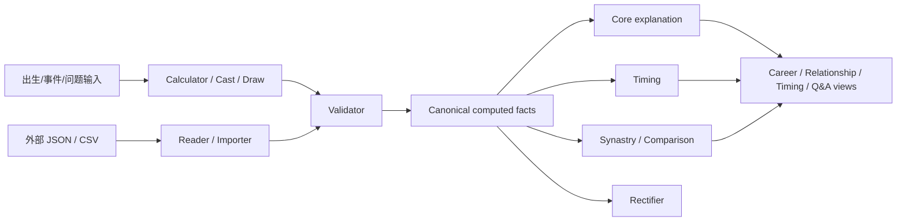

<div align="center">

# Divination Skills

**多体系、可验证、可追溯的占卜计算与 AI Skill 工程**

[English](README-EN.md) · [实施状态](docs/IMPLEMENTATION_STATUS.md) · [扩展路线](docs/EXTENSION_PLAN.md) · [完成审计](docs/COMPLETION_AUDIT.md)

[](https://github.com/dajiaohuang/divination-skills/actions/workflows/validate.yml)
[](pyproject.toml)
[](#体系能力)
[](#30-个-skill)
[](#规则来源与可追溯性)
[](LICENSE)

</div>

---

`divination-skills` 不是一个把十种占卜术塞进同一段 Prompt 的项目。它把每个体系拆成独立的计算器、导入器、验证器、时间层、双盘比较、解释层和安全边界，再用统一契约把它们组合起来。

当前技术路线 M0–M13 已实现并通过自动化验收；正式生产发布仍保持关闭，等待真实领域、版权与部署隐私审核。

```text
technical_complete = 10 / 10
release_ready = 0 / 10
```

## 目录

- [为什么这样设计](#为什么这样设计)
- [总体架构](#总体架构)
- [体系能力](#体系能力)
- [安装](#安装)
- [快速开始](#快速开始)
- [30 个 Skill](#30-个-skill)
- [规则、来源与可追溯性](#规则来源与可追溯性)
- [测试与可复现构建](#测试与可复现构建)
- [项目结构](#项目结构)
- [外部参考与独立性](#外部参考与独立性)
- [发布状态与边界](#发布状态与边界)
- [贡献、安全与许可](#贡献安全与许可)

## 为什么这样设计

多数占卜产品把排盘、流派规则、语言生成和产品文案混在一起。一旦结果有争议，就很难知道问题来自时间输入、历法、计算、流派选择，还是模型临时生成的解释。

本项目把一次输出拆成四层：

1. **原始与标准化输入**：时间、时区、地点、种子、问题分类和显式策略。
2. **确定性事实**：排盘、抽牌、宫位、星曜、爻、数字或时间区间。
3. **规则派生**：只运行已登记的结构化规则，并保留事实 ID、规则 ID 和来源 ID。
4. **语言解释**：不得覆盖计算事实；证据不足时必须降级或拒绝。

由此得到六个工程约束：

- 体系、流派和年代隔离；
- 计算与解释物理分层；
- 外部盘只能导入和比较，不能覆盖原生事实；
- 时间精度不足时自动关闭高敏感模块；
- 随机能力必须支持种子重放和审计；
- 医疗、法律、财务、安全等高影响问题只能提供反思性信息。

## 总体架构



周易、六爻、奇门、Tarot、Lenormand 和卢恩保留各自的即时占问或符号抽取路径，不套用 Vedic Prashna、西方本命或其他体系的规则。

跨体系共用六类契约：

| 契约 | 作用 |
|---|---|
| `reading-session` | 会话、问题分类、盘引用、同意状态与数据分类 |
| `chart-import` | 外部盘来源、字段映射、缺失项与冲突项 |
| `confidence-profile` | 时间精度、模块降级与禁用原因 |
| `timeline` | 大运、流年、行运等统一时间区间 |
| `comparison` | A→B、B→A 与对称双盘事实 |
| `report-profile` | core、career、relationship、timing 等章节选择 |

## 体系能力

| 体系 | 版本 | 当前技术范围 | Skill |
|---|---:|---|---:|
| 八字 | 0.2 | 四柱、节气、真太阳时、藏干、十神、纳音、十二长生、旺相休囚死、支关系、大运、校验、时序与双盘事实 | 7 |
| 西方占星 | 0.2 | 热带黄道、本命、整宫/等宫、主要相位、行运、太阳返照、双盘与出生时间区间扫描 | 7 |
| 紫微斗数 | 0.5 | 原生十二宫与星曜、古典庙旺表、四化与自化路径、可选真太阳时、六层运限、查询、校验、解读与双盘比较 | 6 |
| Tarot | 0.2 | 原创文字版 78 张牌、七种牌阵、正逆位、组合摘要、同意后本地日记与描述统计 | 3 |
| 六爻 | 0.2 | 八宫、世应、纳甲、六亲、六神、旬空、候选用神、显式强度因子与动变事实 | 2 |
| 周易 | 0.2 | 可重放三钱起卦、64 卦、动爻与变卦、两种显式动爻策略、经典来源定位层 | 1 |
| 奇门遁甲 | 0.2 | 拆补转盘、地盘/天盘、九星、八门、八神、值符值使及空亡/入墓/击刑/门迫 | 1 |
| Lenormand | 0.2 | 原创文字版 36 张牌、牌对、九宫与 4×9 Grand Tableau 宫位/坐标 | 1 |
| 卢恩符文 | 0.2 | Elder Futhark 24 符文、可审计抽取、历史证据层与现代反思层隔离 | 1 |
| 数字命理 | 0.2 | Pythagorean 与独立 Chaldean 映射；非拉丁姓名必须由用户明确提供完整拉丁转写 | 1 |

## 安装

### 1. 开发环境

要求：

- Git；
- Python 3.11 或更高版本，CI 使用 Python 3.12；
- 推荐使用 [`uv`](https://docs.astral.sh/uv/)。

```powershell
git clone https://github.com/dajiaohuang/divination-skills.git
cd divination-skills
uv sync --extra dev
```

### 2. 构建 Skill 包

不要直接复制 `systems/*/skills/`：源码 Skill 的脚本会引用仓库模块。应先使用构建器生成自包含包。

```powershell
uv run divination-build . --system all --output dist
```

构建结果是一组以 Skill 名称为根目录的 ZIP。每个包都包含：

- `SKILL.md` 与 `agents/openai.yaml`；
- 运行该 Skill 所需的项目代码；
- 固定版本的 `requirements.txt`；
- `CONTENT_MANIFEST.json` 与逐文件 SHA-256；
- `THIRD_PARTY_NOTICES.json`；
- Apache-2.0 许可证和项目许可状态。

### 3. 安装到 Codex

安装全部构建产物：

```powershell
$target = Join-Path $HOME ".codex\skills"
New-Item -ItemType Directory -Force $target | Out-Null
Get-ChildItem dist\*.zip | ForEach-Object {
    Expand-Archive $_.FullName -DestinationPath $target -Force
}
```

只安装一个 Skill：

```powershell
Expand-Archive dist\ziwei-calculator-0.5.0.zip `
  -DestinationPath "$HOME\.codex\skills" -Force
python -m pip install -r "$HOME\.codex\skills\ziwei-calculator\requirements.txt"
```

Linux/macOS：

```bash
mkdir -p "$HOME/.codex/skills"
for archive in dist/*.zip; do
  unzip -oq "$archive" -d "$HOME/.codex/skills"
done
```

没有第三方 Python 依赖的 Skill 会携带空的 `requirements.txt`。

## 快速开始

安装 Skill 后，可以直接描述任务；Skill 的 frontmatter 会根据触发语义路由。

```text
用 bazi-calculator 给我排四柱：1990-03-15 14:30，Asia/Shanghai。

先用 western-natal 生成本命盘，再用 western-timing 查看
2027-06-01 的行运结构；不要预测确定事件。

用 ziwei-calculator 排盘，然后用 ziwei-validator 校验这份外部 JSON 的差异。

用 tarot-draw 抽凯尔特十字，允许逆位；随后交给 tarot-core，
只做反思性解释，不推断第三方隐私。

用 liuyao-core 起盘；只有在核心盘有效后，再用 liuyao-judgment
按明确的问题分类列出候选用神和结构性强度。
```

也可以直接运行包内脚本。仓库内示例：

```powershell
# 八字
uv run python systems/bazi/skills/bazi-calculator/scripts/calculate.py `
  systems/bazi/examples/sample-input.json

# 紫微
uv run python systems/ziwei/skills/ziwei-calculator/scripts/run.py `
  --local-datetime 2000-01-01T12:00:00 `
  --timezone Asia/Shanghai `
  --calculation-gender female

# 周易
uv run python systems/iching/skills/iching-core/scripts/run.py `
  --question "当前决策中最值得观察的结构是什么？"
```

每个入口支持 `--help`；确定性测试应显式传入种子或完整时间策略。

## 30 个 Skill

### 八字

| Skill | 职责 |
|---|---|
| `bazi-calculator` | 从公历本地时间和 IANA 时区生成四柱、纳音、长生与季节状态，可显式选真太阳时 |
| `bazi-reader` | 隔离导入外部 JSON 或明确的四柱文本 |
| `bazi-validator` | 校验 Schema、边界、来源，并按路径比较外部盘 |
| `bazi-core` | 只解释已验证的四柱、藏干、十神与支关系 |
| `bazi-timing` | 生成显式顺逆方向下的大运、目标年/月与激活事实 |
| `bazi-synastry` | 分离 A→B、B→A 十神关系和对称地支关系 |
| `bazi-rectifier` | 用至少五个带日期事件和训练/保留集扫描时辰候选 |

### 西方占星

| Skill | 职责 |
|---|---|
| `western-natal` | 计算热带地心本命位置、角点、整宫/等宫和主要相位 |
| `western-reader` | 导入结构化 JSON 或行星位置 CSV |
| `western-validator` | 用显式经度容差比较位置、宫位和角点 |
| `western-core` | 对已验证本命事实做有引用的结构解释 |
| `western-timing` | 计算行运到本命相位、太阳返照和统一时间线 |
| `western-synastry` | 对称跨盘相位与方向性宫位叠加 |
| `western-rectifier` | 用训练/保留事件集排名出生时间区间 |

### 紫微斗数

| Skill | 职责 |
|---|---|
| `ziwei-calculator` | 项目原生 v0.5 本命盘、古典庙旺表与显式真太阳时，不调用或打包 iztro |
| `ziwei-reader` | 隔离读取结构化外部 JSON |
| `ziwei-validator` | 比较宫位、星曜、庙旺、自化、时间基础和流派差异，不覆盖任一盘 |
| `ziwei-core` | 实验性宫星、空宫、三方四正与生年四化结构解读 |
| `ziwei-timing` | 大限、小限、流年、流月、流日、流时结构层 |
| `ziwei-synastry` | 方向性年干四化目标与对称同宫主星事实 |

### Tarot

| Skill | 职责 |
|---|---|
| `tarot-draw` | 对文字版 RWS 兼容牌组执行可重放、不放回抽牌 |
| `tarot-core` | 解释已验证牌面、位置、方向和基础相邻关系 |
| `tarot-journal` | 明确同意后写入本地 JSONL，并只做描述统计 |

### 周易、六爻与奇门

| Skill | 职责 |
|---|---|
| `iching-core` | 三钱起卦、变卦、显式动爻策略和经典来源定位 |
| `liuyao-core` | 文王纳甲核心结构与时间上下文 |
| `liuyao-judgment` | 独立问题规则包下的候选用神、强度分量和动变关系 |
| `qimen-hour` | 时家转盘拆补法的完整限定结构盘，不做断事 |

### Lenormand、卢恩与数字命理

| Skill | 职责 |
|---|---|
| `lenormand-core` | 单张、三张、九宫与 4×9 Grand Tableau |
| `runes-core` | Elder Futhark 抽取，历史证据与现代反思严格分层 |
| `numerology-core` | Pythagorean/Chaldean 独立映射与可审计归约 |

## 规则、来源与可追溯性

每个体系保留自己的：

```text
SCOPE.md
LINEAGE.md
DATA_CONTRACT.md
KNOWN_DISPUTES.md
KNOWN_LIMITATIONS.md
VERSION
rules/*.json
sources/*.json
tests/golden/
tests/edge_cases/
tests/disputes/
reviews/
skills/
```

结构化规则至少包含稳定 ID、体系、流派、版本、条件、结论、优先级、来源和测试引用。输出链路为：

```text
source_id → rule_id → fact path → derived finding → report sentence
```

来源清单会记录许可、商业使用状态、定位方式、本地快照和生产资格。`reference_only` 来源只能用于研究或差异比较，构建器禁止把它们放进 Skill 包。

## 测试与可复现构建

当前自动化快照：

| 指标 | 数量 / 状态 |
|---|---:|
| 体系 | 10 |
| Skill | 30 |
| 结构化规则 | 107 |
| 来源清单 | 29 |
| 基线 Golden Cases | 255 |
| 边界案例 | 68 |
| 流派分歧案例 | 48 |
| 错误输入案例 | 20 |
| 扩展功能回放案例 | 850 |
| pytest | 1518 passed |
| 技术完整性 | 10/10 |

完整验证：

```powershell
uv run pytest -q
uv run ruff check .
uv run divination-validate .
uv run divination-readiness . --require-technical
uv run divination-build . --system all --output dist
```

构建测试会：

- 连续构建两次并比较 ZIP 哈希；
- 在仓库外解压全部 30 个包；
- 以隔离 Python 路径执行每个 Skill 的入口工作流；
- 校验包内逐文件大小和 SHA-256；
- 断言没有 `.git`、submodule、上游源码、`reference_only` 资料或 iztro/Node 运行时。

## 项目结构

```text
divination-skills/
├── common/
│   ├── schemas/                 # 跨体系和治理契约
│   ├── examples/                # 合法契约与示例记录
│   ├── report-spec/             # 可审计报告和产品视图
│   ├── evaluation/              # 发布复核协议
│   └── deployment/              # fail-closed 部署隐私决策
├── systems/
│   ├── bazi/
│   ├── western_astrology/
│   ├── ziwei/
│   ├── tarot/
│   ├── iching/
│   ├── liuyao/
│   ├── qimen/
│   ├── lenormand/
│   ├── runes/
│   └── numerology/
├── tooling/
│   ├── src/divination_skills/   # validation/build/readiness/evidence CLI
│   ├── scripts/                 # 评审队列与参考差异工具
│   └── tests/
├── catalog/sources/             # 全局来源台账
├── docs/                        # 路线、ADR、政策、评估与审计
├── references/
│   ├── README.md                # 参考登记
│   └── upstream/                # 本地参考；整个目录被 Git 忽略
└── .github/workflows/validate.yml
```

## 外部参考与独立性

本项目研究了以下被忽略的本地参考：

- `vedic-astro-skills`：只参考 Calculator / Reader / Core / Timing / Synastry / Rectifier / Horary 的职责拆分；
- `iztro` 2.5.8：只用于紫微字段覆盖、边界和人工差异分类；
- `kinqimen`：只用于奇门字段覆盖和可行性研究。

它们都不是 submodule、运行依赖、构建依赖或测试依赖。仓库不复制其代码、Prompt、规则资料、翻译或数据表。即使删除整个 `references/upstream/`，生产测试和构建仍应全部通过。

固定版本、许可证风险和用途见[参考资料登记](references/README.md)。

## 发布状态与边界

技术完整不等于领域认可或生产授权。当前：

```text
technical_complete = 10 / 10
release_ready = 0 / 10
project_license_status = selected
deployment_privacy_status = undecided
bazi expert_accepted = 0 / 50
extension domain-review cases accepted = 0 / 221
```

主要边界：

- 八字强弱、用神、格局和确定事件预测没有被包装成专家共识；
- 西方卜卦占星被评估为未来独立体系，没有混入本命模块；
- 紫微解释与双盘规则仍是 experimental；
- 周易不捆绑经典译文，六爻规则包和奇门结构盘仍需独立专家验收；
- Tarot、Lenormand、卢恩和数字命理提供符号反思，不宣称预测有效性；
- OCR/PDF、风水、手相、面相与 Human Design 不在当前范围。

正式发行必须使用：

```powershell
uv run divination-build . --system all --output dist --release
```

在真实审核人完成各体系领域、版权和隐私签核，并记录实际部署的数据流之前，该命令会返回 `release_not_ready` 且不生成正式发行产物。普通构建只用于技术验证。

## 贡献、安全与许可

- 贡献规则：[CONTRIBUTING.md](CONTRIBUTING.md)
- 安全报告：[SECURITY.md](SECURITY.md)
- Clean-room 与来源政策：[docs/policies](docs/policies)
- 完整实现证据：[docs/COMPLETION_AUDIT.md](docs/COMPLETION_AUDIT.md)

项目自有代码、规则、文档和 Skill 内容采用 [Apache License 2.0](LICENSE)。第三方 Python 包、外部文献和参考项目继续遵守各自许可证；Apache-2.0 不替代专业领域、版权、隐私或高影响用途审核。
